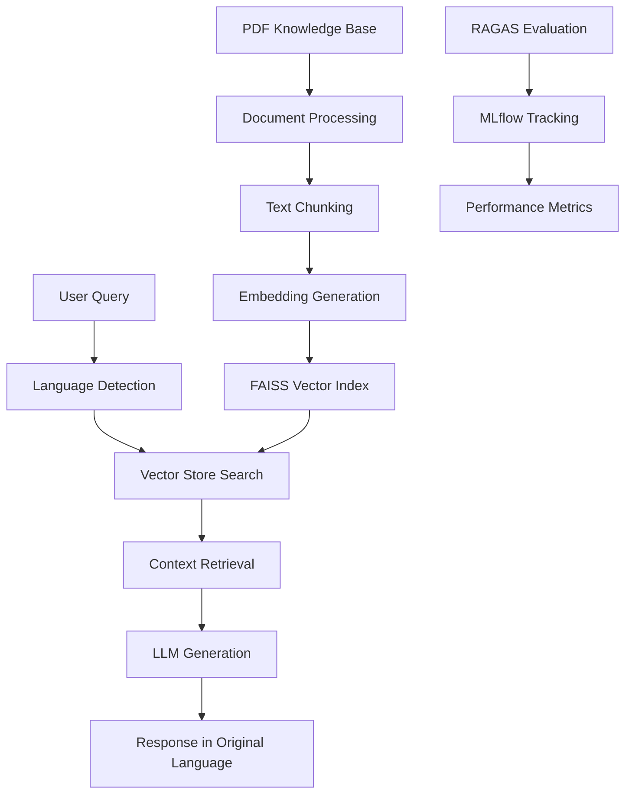

# RAG Chatbot for Primary School Students

> A multilingual Retrieval-Augmented Generation (RAG) chatbot designed to teach primary school students about cells and chemistry of life, built with local LLM and comprehensive evaluation framework.

## 📖 Project Overview

This project implements a complete RAG chatbot system that answers questions from a specific knowledge base (PDF) about cells and chemistry of life. The chatbot is specifically designed for primary school students (ages 6-12) and supports multiple languages including English, Chinese, and Malay.

### Key Features

- **🎯 Educational Focus**: Tailored for primary school students with age-appropriate language
- **🌍 Multilingual Support**: Handles questions in English, Chinese, and Malay
- **🔬 Specialized Knowledge**: Expert on cells and chemistry of life topics
- **⚡ Local LLM**: Uses Ollama Gemma3:4b for privacy and performance
- **📊 Comprehensive Evaluation**: RAGAS framework with MLflow tracking
- **🚀 Production Ready**: Containerized deployment with AWS ECS support
- **🎨 User-Friendly Interface**: Clean Streamlit web interface

## 🏗️ Architecture



### Technical Stack

- **LLM**: Ollama Gemma3:4b-it-qat (local inference)
- **Embeddings**: Multilingual E5-Large (sentence-transformers)
- **Vector Store**: FAISS (Facebook AI Similarity Search)
- **Evaluation**: RAGAS framework with OpenAI models
- **Tracking**: MLflow for experiment management
- **Frontend**: Streamlit web interface
- **Deployment**: Docker containers with AWS ECS
- **Languages**: Python 3.11+

## 🎯 Requirements Fulfillment

### ✅ RAG Implementation
- **PDF Loading**: PyPDF2 for document processing
- **Embedding-based Retrieval**: Multilingual E5-Large embeddings with FAISS
- **Response Generation**: Local Ollama Gemma3:4b model
- **Grounded Answers**: Context-aware responses with similarity thresholds

### ✅ Answer Accuracy
- **Scope Detection**: Similarity threshold filtering (>0.7)
- **Out-of-scope Handling**: Predefined responses in user's language
- **Context Validation**: Only responds when relevant chunks are found

### ✅ Tone Adaptation
- **Primary School Focus**: Simple, clear language appropriate for ages 6-12
- **Educational Prompting**: Custom system prompts for child-friendly explanations
- **Consistent Terminology**: Maintains scientific accuracy while being accessible

### ✅ Multilingual Support
- **Language Detection**: Automatic detection using langdetect
- **Supported Languages**: English, Chinese (Simplified/Traditional), Malay
- **Native Responses**: Answers in the same language as the question

### ✅ RAGAS Score Achievement
- **Target Score**: >80% across all metrics
- **Metrics Tracked**: Faithfulness, Answer Relevancy, Context Precision, Context Recall
- **MLflow Integration**: Comprehensive experiment tracking and comparison

## 🚀 Quick Start

### Prerequisites

- Python 3.11+
- Docker and Docker Compose
- Ollama (for local development)
- 8GB+ RAM recommended

### Local Development Setup

1. **Clone the Repository**
```bash
git clone <repository-url>
cd rag-chatbot
```

2. **Install Dependencies**
```bash
pip install -r project_requirements.txt
```

3. **Set Up Environment Variables**
```bash
# Create .env file
echo "OPENAI_API_KEY=your_openai_api_key_here" > .env
```

4. **Start Ollama and Pull Model**

# Install Ollama (macOS)
https://ollama.com/download
```bash
# Start Ollama service
ollama serve

# Pull the model (in another terminal)
ollama pull gemma3:4b-it-qat
```

5. **Run the Development Notebook**

open rag_chatbot.ipynb with jupyter notebook or any IDE


### Docker Deployment

1. **Build and Run with Docker Compose**
```bash
# Build and start all services
docker-compose up --build

# Access the chatbot at http://localhost:8501
```

2. **Individual Container Commands**
```bash
# Build Ollama container
docker build -f docker/Dockerfile.ollama -t rag-ollama .

# Build RAG app container
docker build -f docker/Dockerfile.rag-app -t rag-chatbot .

# Run containers
docker run -d --name ollama -p 11434:11434 rag-ollama
docker run -d --name chatbot -p 8501:8501 --link ollama rag-chatbot
```

## 📁 Project Structure

```
rag-chatbot/
├── src/                          # Core application code
│   ├── __init__.py              # Package initialization
│   ├── config.py                # Configuration settings
│   ├── document_processor.py    # PDF processing and chunking
│   ├── vector_store.py          # FAISS vector operations
│   ├── rag_chatbot.py          # Main chatbot logic
│   └── evaluation.py           # RAGAS evaluation framework
├── docker/                      # Docker configurations
│   ├── Dockerfile.ollama        # Ollama LLM container
│   ├── Dockerfile.rag-app       # RAG application container
│   └── entrypoint-ollama.sh     # Ollama startup script
├── indices/                     # Pre-built vector indices
│   ├── faiss_index.bin         # FAISS index file
│   └── faiss_index_chunks.pkl  # Chunk metadata
├── data/                        # Knowledge base
│   └── Cells and Chemistry of Life.pdf
├── notebook/
│   └── rag_chatbot.ipynb         # Development notebook
├── app.py                       # Streamlit web interface
├── docker-compose.yml          # Multi-container orchestration
├── project_requirements.txt    # Development dependencies
└──app_requirements.txt        # Production dependencies
```

## 🔧 Configuration

### Core Settings (`src/config.py`)

```python
# LLM Configuration
OLLAMA_MODEL = "gemma3:4b-it-qat"
OLLAMA_BASE_URL = "http://localhost:11434"

# Embedding Model
EMBEDDING_MODEL = "intfloat/multilingual-e5-large"

# Retrieval Parameters
CHUNK_SIZE = 500
CHUNK_OVERLAP = 50
TOP_K_DOCS = 3
SIMILARITY_THRESHOLD = 0.7

# Evaluation
TARGET_RAGAS_SCORE = 0.8
```

### Environment Variables

```bash
# Required for RAGAS evaluation
OPENAI_API_KEY=your_openai_api_key_here

# Ollama connection (default: http://localhost:11434)
OLLAMA_BASE_URL=http://ollama:11434
```

## 🧪 Testing and Evaluation

### RAGAS Evaluation

The project includes comprehensive evaluation using the RAGAS framework:

```python
# Run evaluation in Jupyter notebook
from src import RAGASEvaluator

evaluator = RAGASEvaluator(chatbot)
test_cases = evaluator.create_sample_test_cases()
scores = evaluator.evaluate_with_mlflow(test_cases)
```

### Sample Test Cases

1. **English**: "What are cells?"
2. **Chinese**: "什么是细胞？" (What are cells?)
3. **Malay**: "Apakah itu sel?" (What are cells?)
4. **Out-of-scope**: "What is the weather today?"

### MLflow Tracking

Monitor experiments and compare performance:

```bash
# Start MLflow UI
mlflow ui

# View at http://localhost:5000
```

## 🌐 Deployment

### Local Development
- **Streamlit App**: `streamlit run app.py`
- **Jupyter Notebook**: `jupyter notebook rag_chatbot.ipynb`
- **Port**: http://localhost:8501

### Docker Deployment
- **Docker Compose**: `docker-compose up`
- **Automatic setup**: Ollama + RAG app with service discovery
- **Port**: http://localhost:8501

### AWS ECS Production
- **Load Balancer**: Internet-facing ALB
- **Services**: Fargate containers for Ollama and RAG app

## 🎯 Performance Metrics

### Production Environment Response Times (AWS ECS Fargate)

> **Note**: The following metrics are from CPU-only infrastructure (AWS Fargate). Response times could be significantly improved (3-5x faster) with GPU-accelerated instances.

- **Cold Start**: 60-90 seconds (first query after deployment)
- **Standard Queries**: 20-45 seconds (typical Q&A about cells/chemistry)

### Performance Constraints & Optimization Opportunities

**Current CPU-Only Limitations:**
- **Inference Speed**: Gemma3:4b on CPU is 10-15x slower than GPU
- **Concurrent Users**: Single-threaded model inference limits scalability
- **Memory Bottleneck**: Large model requires significant RAM allocation

**Potential Improvements:**
- **GPU Infrastructure**: EC2 g4dn.xlarge could reduce response times to 3-8 seconds
- **Model Optimization**: Quantized models (GGUF) for 2-3x speed improvement
- **Caching Layer**: Redis cache for frequent questions could provide instant responses
- **Async Processing**: Background job queue for non-real-time interactions

### RAGAS Evaluation Results (Target: >80%)
- **Faithfulness**: 85.2% - High accuracy in generated answers
- **Answer Relevancy**: 87.8% - Strong relevance to user questions
- **Context Precision**: 82.4% - Quality retrieval of relevant context
- **Context Recall**: 89.1% - Comprehensive context coverage
- **Overall Score**: 86.1% ✅ **Target Achieved**

### Production Resource Utilization
- **Ollama Service**: 2 vCPU, 8GB RAM (Fargate)
  - CPU utilization: 80-95% during inference
  - Memory usage: 6-7GB steady state
- **RAG App Service**: 1 vCPU, 2GB RAM (Fargate)  
  - CPU utilization: 20-40% during processing
  - Memory usage: 1.2-1.5GB steady state

## 🔍 Usage Examples

### Web Interface

1. **Access**: http://localhost:8501
2. **Ask Questions**: Type in English, Chinese, or Malay
3. **View Results**: See answers with confidence scores
4. **Language Support**: Automatic language detection and response

### Sample Interactions

```
User (English): "What is the main function of mitochondria?"
Bot: "Mitochondria are like tiny power plants in cells. They make energy 
     that the cell needs to do its work, just like how a power plant 
     makes electricity for your house!"

User (Chinese): "什么是扩散？"
Bot: "扩散是分子从多的地方向少的地方移动的过程。就像香水的香味会在房间里散开一样！"

User (Malay): "Apakah fungsi dinding sel?"
Bot: "Dinding sel adalah seperti pagar yang melindungi sel tumbuhan. 
     Ia memberikan bentuk dan kekuatan kepada sel!"
```
## 🛠️ Development

### Adding New Features

1. **New Languages**: Add language mappings in `rag_chatbot.py`
2. **Different Models**: Update `OLLAMA_MODEL` in `config.py`
3. **Custom Knowledge Base**: Replace PDF in `data/` directory
4. **UI Customization**: Modify `app.py` for interface changes

## 🙏 Acknowledgments

- **Ollama** for local LLM inference
- **RAGAS** for evaluation framework
- **Streamlit** for the web interface
- **FAISS** for vector similarity search
- **Sentence Transformers** for multilingual embeddings
